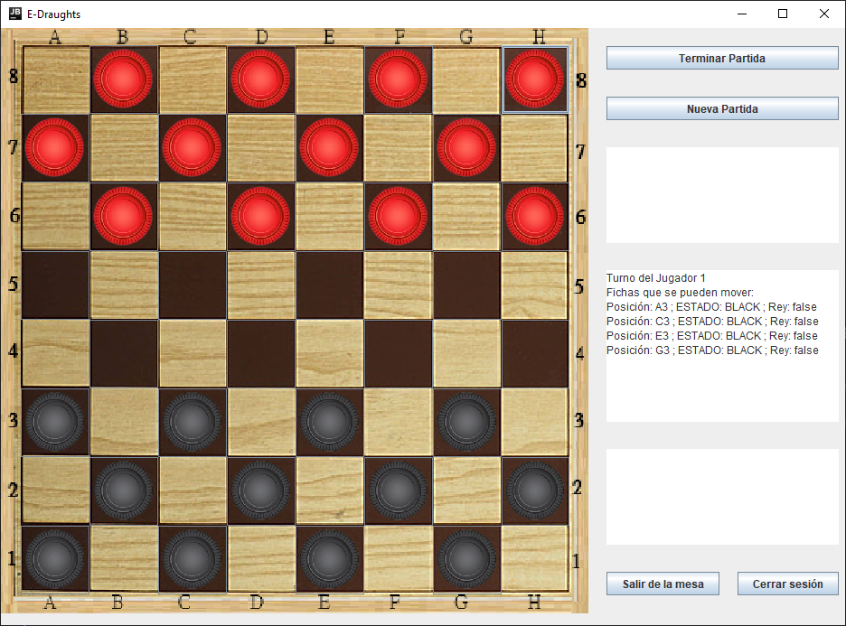

# English Draughts
 
**Integrantes**:
 
| Nombre                | Apellidos     | Código    |
| --------------------- | ------------- | --------- |
| Juan de Dios Fernando | Lerzundi Ríos | 20191394C |
| Joshua Jean Paul  | Del Rosario Sosa | 20162208K |
| Gabriel Esteban  | Quiroz Gomez | 20191394C |
 
## Lista de Funciones del Programa:
- [X] Creación de Cuenta de Usuario:
    - [X] nombre
    - [ ] email
    - [X] contraseña
- [X] Inicio de Sesión
- [X] Cierre de Sesión
- [X] Gameplay
    - [X] Colocación de fichas
    - [X] Movimientos de fichas
    - [X] Implementación de reglas de juego 
- [ ] Grabación del juego
    - [ ] fecha 
    - [ ] hora 
    - [ ] oponente
    - [ ] lista de movimientos
    - [ ] resultado
- [ ] Repetición de un juego
- [ ] Multijugador
    - [ ] Contra otro usuario
    - [ ] Contra la máquina
- [X] Marco de Prueba Unitario (Parcialmente) 

## Reglas de Juego: [Fuente de las Reglas](https://www.draughtsforandroid.com/news/draughts-different-rules-game-53.html) (Link temporal hasta conseguir una fuente más oficial)
- El tablero es de 8x8 casillas, las piezas se mueven es los espacios oscuros.
- Cada jugador tiene 12 piezas.
- El jugador con las piezas oscuras realiza el primer movimiento
- Las piezas se mueven en diagonal de casilla en casilla y solo hacia adelante, excepto la reina
- Cuando una pieza llega al otro extremo del tablero se vuelve rey.
- El rey puede moverse y capturar hacia adelante y hacia atrás, pero solo una casilla.
- Puedes hacer una captura concatenada si las piezas están en fila separadas por una casilla, si es una pieza regular solo puede capturar hacia adelante.
- Si puedes capturar una pieza estás obligado a hacerlo, pero no estás obligado a capturar la mayor cantidad de piezas posible.